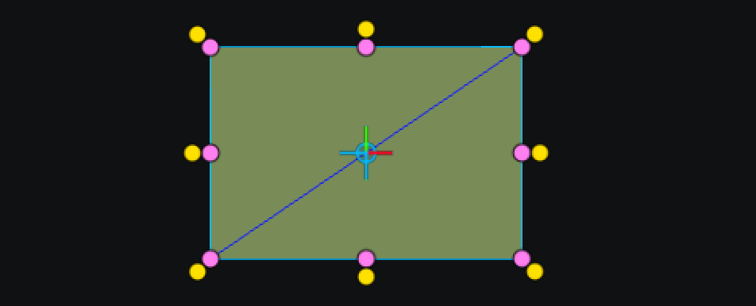

# Using Kantan Mapper in TouchDesigner 

**The goal is to use KantanMapper in TouchDesigner to create video mapping installations. KantanMapper allows you to place shapes and masks on real life objects and assign TOP nodes to them.**

The process will consists of setting up KantanMapper in TouchDesigner, creating shapes, and attribute visuals to them.

# Set up with the projector

///

# Set up in Kantan

Open the **KantanMapper** window from the Palette, in the Mapping tab.

In the KantanMapper container, click on `Open Kantan window`.

The left part is the controls, with the list of the shapes and the tools.
The right part is the canvas that you project.

You can fill in the resolution of your video projector, and open `Window Options`.

In the **Options window**, make sure the `Monitor` selected is your video projector (often 0 is your main screen, 1 your projector).

# Mapping the surfaces

## Tools

The first arrow tool allows you to move, rotate (using the yellow handles), and rescale (using the pink handles) shapes.

The second arrow tool allows you to move individually each point of the shape. Once a point is selected, you can also move it using your keyboard.

To create your shapes, you can use either the quad or the freeform tool for either bezier or straight lines.

You can also group shapes to be able to move, rotate and rescale all the shapes at the same time.

## Adding textures

Once you created a shape and placed it where you need, you can add a texture by dragging and dropping a TOP in the `Texture` slot.

To activate the texture, don't forget to click the cross button next to the texture.

You can soften the edge of your texture by clicking the cross button of the `Softedge` control and changing the `Width` and other values.

When your texture is on your shape, you can modify it by changing the orientation, or by opening the `Edit Texture` window.

In `Edit Texture`, you can flip, crop and resize your texture to fit the shape.

By using `Set as Mask`, you can use your shape as a mask on your texture, to make sure it won't become distorted when applied to the shape.
